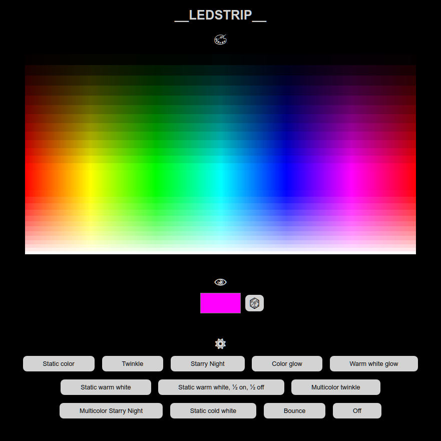

# ledstrip

An IoT project to control a multi-colored (RGBW) LED strip for decoration and home lighting using the ESP8266 chip.

The LED strip used is SK6812. It has strict timing requirements down to 150 ns level. Thus assembler commands had to be used to control it fast enough. On the physical side, the I/O of ESP8266 is 3.3 V whereas the LED strip uses 5 V. A "sacrificial LED" technique was used to pump up the signal level to a theoretical 4.3 V for the other LEDs, as a traditional level shift circuit did not work.

Color and mode of the LEDs can be chosen from a web page served by the device.

A config file `current.json` must be created first. There is a template `default.json` for that purpose.

